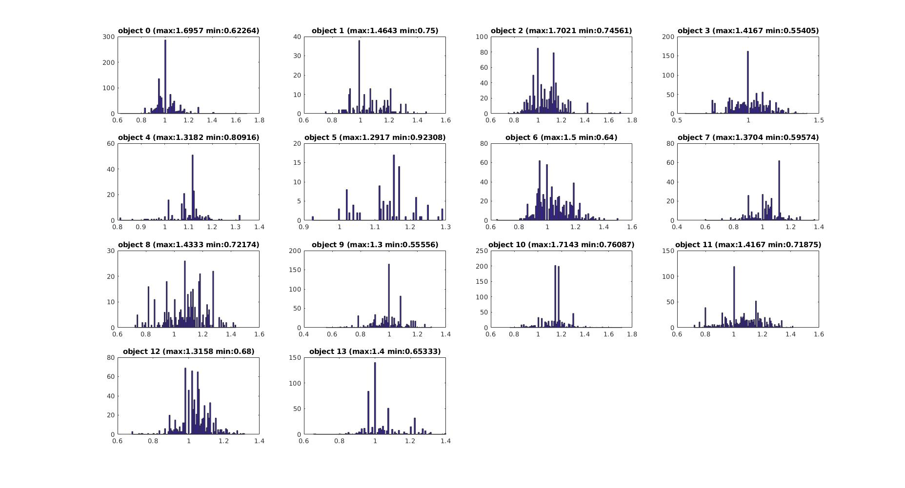

# Vision

## Configuration

```c++
// install opencv for ros
$ sudo apt-get install ros-kinetic-vision-opencv
```

 if use ACF (aggregated channel feature) detector

1. Download pdollar matlab toolbox to ACF model

```
$ git clone https://github.com/pdollar/toolbox.git
```

2. Download the C++ implementation which can apply the trained model in ros, but need to build it on your PC

```c++
// download the c++ implementation
$ git clone https://github.com/elucideye/acf.git

// require gcc complier, CMake, Python, Polly
// add "PATH=$PATH:$HOME/polly/bin" to .bash_profile
$ source .bash_profile

// build the c++ implementation
$ export qvsJC2xEpIrp49xQ=[secure]
$ export TOOLCHAIN=gcc-5-pic-hid-sections-lto
$ export CONFIG=Release
$ export INSTALL=--strip
$ export TEST=--test
$ export GPU=OFF
$ export BUILD_SHARED=ON
$ export CXX=g++
$ export CC=gcc

$ source bin/hunter_env.sh

$ bin/travis_build.sh "${TOOLCHAIN}" "${CONFIG}" "${INSTALL}"
```

apt-get install libspdlog-dev


3. After building the C++ implementation, you can directly link the shared library in CMakeLists.txt

```
include_directories(
{directory of the .h file}
)

target_link_libraries({project_name}
{directory of the shared library}
)
```

Because C++ code need to be built by c++11 standardization, you need to enable c++11 in ros when building the project

```
include(CheckCXXCompilerFlag)
CHECK_CXX_COMPILER_FLAG("-std=c++11" COMPILER_SUPPORTS_CXX11)
CHECK_CXX_COMPILER_FLAG("-std=c++0x" COMPILER_SUPPORTS_CXX0X)
if(COMPILER_SUPPORTS_CXX11)
    set(CMAKE_CXX_FLAGS "-std=c++11")
elseif(COMPILER_SUPPORTS_CXX0X)
    set(CMAKE_CXX_FLAGS "-std=c++0x")
else()
    message(FATAL_ERROR "The compiler ${CMAKE_CXX_COMPILER} has no C++11 support. Please use a different C++ compiler.")
endif()
```


## Dataset

On Oct 15 two video, **lab_maze.avi** and **lab_maze2.avi** were record.

use ffmpeg to extract images from videos

```
ffmpeg -i [video dir] -vf fps=10 %1d.png
```

another video **light.avi**

**Overall 14 classes of objects**

|                  |                    |                      |
| ---------------- | ------------------ | -------------------- |
| 0: Yellow Ball   | 1: Yellow Cube     |                      |
| 2: Green Cube    | 3: Green Cylinder  | 4: Green Hollow Cube |
| 5: Orange Cross  | 6: Orange Star     |                      |
| 7: Red Cylinder  | 8: Red Hollow Cube | 9: Red Ball          |
| 10: Blue Cube    | 11: Blue Triangle  |                      |
| 12: Purple Cross | 13: Purple Star    |                      |


### Data property

check the aspect ratio and size of different objects




### Object pos

farthest visual distance 57 cm 

closest visual distance 5 cm


### Color

In opencv, the range of hsv

h: 0~180

s: 0~255

v: 0~255

 

## Classifier

Build virtual environment for classifier

```
cd ~
virtualenv --system-site-packages ~/tensorflowenv

source ~/tensorflowenv/bin/activate

pip install --upgrade tensorflow

deactivate
```

Run classifier on ros

```
roscd [package]
chmod +x [file.py]
rosrun 
```


## Obstacle Detector

geometry of depth image

| Real size / cm | image size | depth | Real size / image size / depth |
| -------------- | ---------- | ----- | ------------------------------ |
| 4              | 90         | 207   | 0.000214                       |
| 6.5            | 161        | 190   | 0.000212                       |
| 7.8            | 178        | 205   | 0.000213                       |
| 2.2            | 178        | 198   | 0.000202                       |

 Thus, we can estimate the obstacle size based on image size, distance
$$
Real size = 0.000213 \times imageSize \times depth
$$


## Log

| Time       | Done                                                         | To do                                         |
| ---------- | ------------------------------------------------------------ | --------------------------------------------- |
| 2018-11-13 | Integrated SVM color classifier into ros                     | 1. Select the best bbx                        |
|            |                                                              | 2. Purple and red objects detection bad       |
|            |                                                              | 3. Rosbag or save as a video                  |
| 2018-11-14 | Fix the problem why red and purple objects can not be detected. (BGR to RGB) | 1. Detect a image blurry or not               |
|            | Generate classify dataset                                    | 2. Extract the training dataset               |
|            |                                                              | 3. Split with training and validation dataset |

### 2018-11-21

Train more than 20,000 images with size of 160 * 160 

Split 90% for training and 10% for validation

**Result:**

The accuracy of validation dataset is 91.4%

Test the model on overall dataset

| Class             | # Class | # Correctly classified | Accuracy / % |
| ----------------- | ------- | ---------------------- | ------------ |
| Yellow Ball       | 1650    | 1639                   | 99.33        |
| Yellow Cube       | 768     | 760                    | 98.96        |
| Green Cube        | 2406    | 2406                   | 100          |
| Green Cylinder    | 2364    | 2348                   | 99.32        |
| Green Hollow Cube | 756     | 695                    | 91.93        |
| Orange Cross      | 60      | 0                      | 0            |
| Orange Star       | 1794    | 1794                   | 100          |
| Red Cylinder      | 1242    | 988                    | 79.55        |
| Red Hollow Cube   | 918     | 857                    | 93.35        |
| Red Ball          | 1926    | 1925                   | 99.95        |
| Blue Cube         | 588     | 580                    | 98.64        |
| Blue Triangle     | 1812    | 803                    | 44.32        |
| Purple Cross      | 2658    | 2657                   | 99.96        |
| Purple Star       | 2046    | 1953                   | 95.4         |


Remove some unclear images

| Class             | # Class |                          |       | acc   |
| ----------------- | ------- | ------------------------ | ----- | ----- |
| Yellow Ball       | 1638    | OK                       |       | 100   |
| Yellow Cube       | 755     | OK                       |       | 97.48 |
| Green Cube        | 1604    | OK                       |       | 100   |
| Green Cylinder    | 1294    | OK                       |       | 63.25 |
| Green Hollow Cube | 696     | completely wrong         | +558  | 95.53 |
| Orange Cross      | 48      | completely wrong         | +762  | 83.58 |
| Orange Star       | 1108    | OK                       |       | 96.84 |
| Red Cylinder      | 798     | 立起来的还行，平躺不行   | +1498 | 73.52 |
| Red Hollow Cube   | 882     | 偶尔错误，识别为cylinder | +1039 | 86.15 |
| Red Ball          | 1535    | OK                       |       | 99.47 |
| Blue Cube         | 504     | OK                       |       | 58.33 |
| Blue Triangle     | 816     | sometimes wrong          | +716  | 99.80 |
| Purple Cross      | 1564    | OK                       |       | 99.55 |
| Purple Star       | 905     | completely wrong         | +668  | 95.25 |


### 2018-11-23

Ball, 2, 3053

Cube 3, 4561

Cylinder 2, 3188

Hollow Cube 2, 3238

Cross 2, 3290

Star 2, 3005

Triangle 1, 1578


### 2018-11-28

| Class             | # Class |                                            |       | acc   |      |
| ----------------- | ------- | ------------------------------------------ | ----- | ----- | ---- |
| Yellow Ball       | 273     | OK                                         | +1205 | 100   | 1473 |
| Yellow Cube       | 250     | OK                                         | +1121 | 97.48 | 1371 |
| Green Cube        | 401     | OK                                         | +1122 | 100   | 1523 |
| Green Cylinder    | 341     | often g_hollow                             | +1216 | 63.25 | 1557 |
| Green Hollow Cube | 116     | OK                                         | +1633 | 95.53 | 1749 |
| Orange Cross      | 16      | sometimes                                  | +1646 | 83.58 | 1662 |
| Orange Star       | 329     | not good enough when it stand and fas away | +1063 | 96.84 | 1392 |
| Red Cylinder      | 133     |                                            | +1498 | 73.52 | 1631 |
| Red Hollow Cube   | 147     | Bad                                        | +1342 | 86.15 | 1489 |
| Red Ball          | 307     | OK                                         | +1273 | 99.47 | 1580 |
| Blue Cube         | 84      | Bad                                        | +1583 | 58.33 | 1667 |
| Blue Triangle     | 272     | OK                                         | +1306 | 99.80 | 1578 |
| Purple Cross      | 390     | Sometimes                                  | +1238 | 99.55 | 1628 |
| Purple Star       | 313     | Sometimes                                  | +1300 | 95.25 | 1613 |
